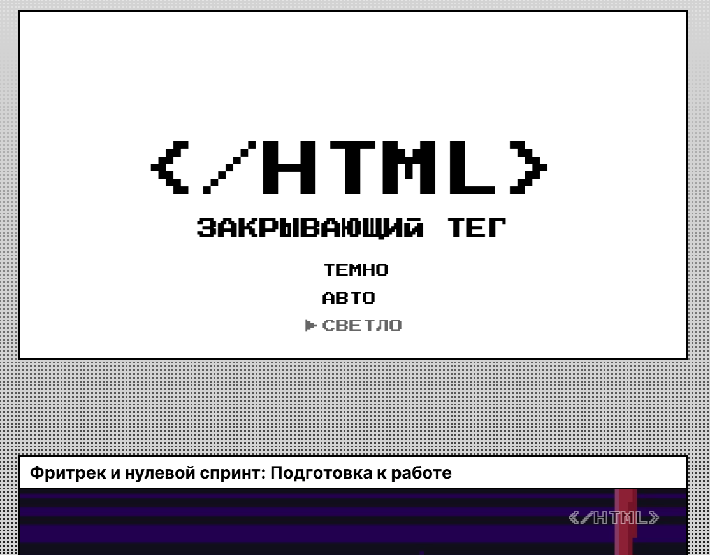
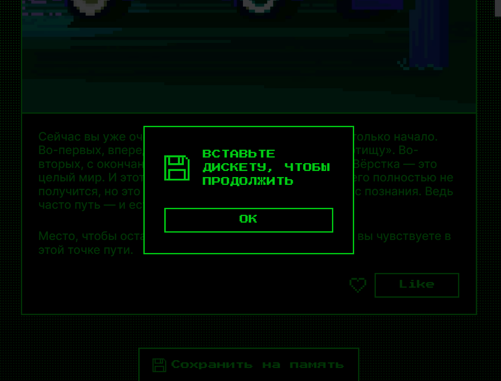

# Закрывающий тег — адаптивный сайт с темами

Адаптивная страница с двумя цветовыми темами, анимациями и модальным окном. Свёрстана на HTML, CSS и JavaScript по макету Figma.

## 🔗 Макет

[Ссылка](https://www.figma.com/design/JQhPLs2COLIeZtAtlsBS34/-8-%3C-закрывающий-тег%3E?node-id=0-1&p=f)

## Скриншоты





## Технологии

- HTML5: семантика, `<dialog>`, `<template>`, `<symbol>` / `<use>`, SVG инлайном
- CSS3: Grid, Flexbox, логические свойства, CSS-переменные, `clamp()`, градиенты, `mix-blend-mode`, `@supports`, keyframes
- Vanilla JS: переключение тем, лайк, модальное окно
- БЭМ

## Запуск

Открыть `index.html` в браузере или запустить локальный сервер:

```bash
python3 -m http.server 8080
# Открыть http://localhost:8080
```

## Структура

```
zakryvayushchiy-teg-f/
├── index.html
├── fonts/
│   ├── fonts.css          # подключение Inter (вариативный) и PressStart2P
│   └── *.woff2
├── images/
│   ├── *.png / *.jpg      # картинки карточек
│   ├── favicon.ico
│   ├── favicon.svg        # адаптивный под тему ОС
│   └── icons/             # SVG-иконки 
├── styles/
│   ├── variables.css      # цвета, шрифты, отступы, размеры
│   ├── globals.css        # сброс стилей
│   ├── themes.css         # тёмная / светлая темы
│   ├── style.css          # основные стили 
│   └── animations.css     # анимации
└── scripts/
    ├── like.js            # лайк: переключение is-liked
    └── set-theme.js       # переключение тем: light / dark / auto
```

## Особенности

- Резиновая вёрстка
- Фон: сложный множественный градиент (`repeating-linear-gradient` по X и Y + линейный по вертикали), `background-size: cover`, `background-attachment: fixed`
- Логические свойства
- Анимации через `transition` с указанием конкретных свойств и `@keyframes`
- Все интерактивные элементы имеют `:hover` и `:focus-visible`
- Декоративные элементы через псевдоэлементы, `aria-hidden="true"` где нужно
